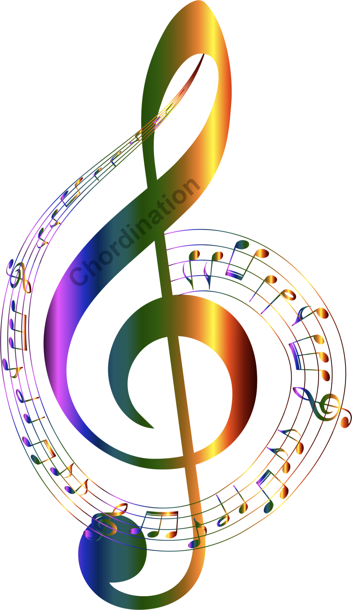
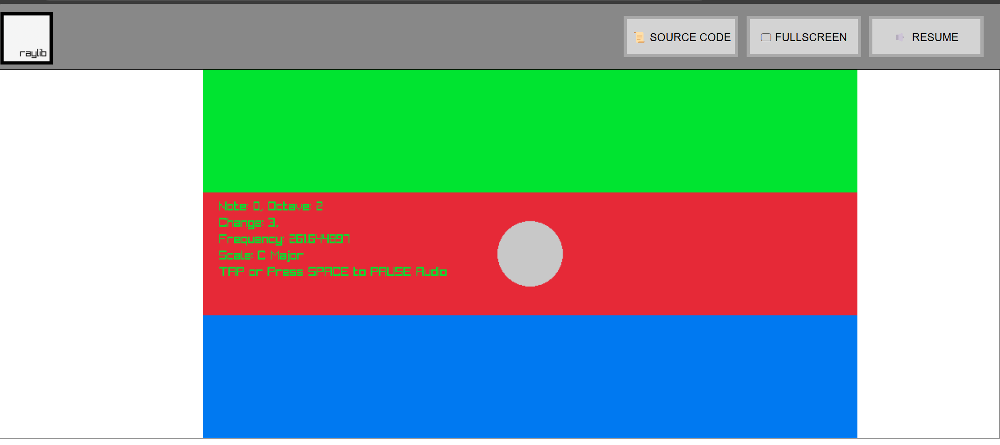
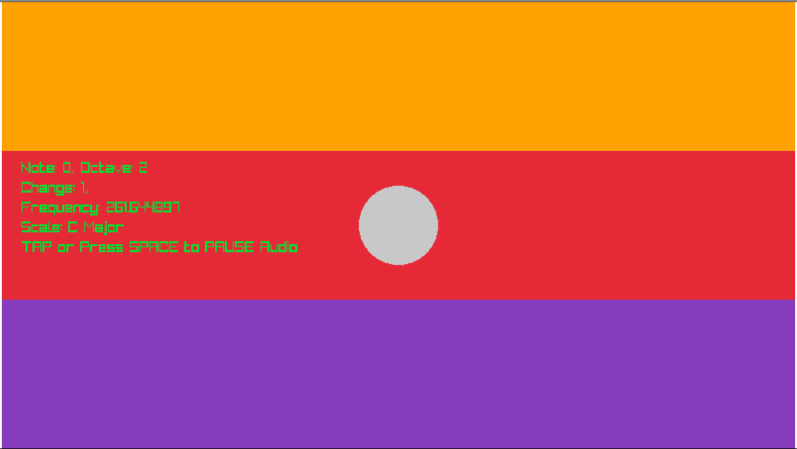
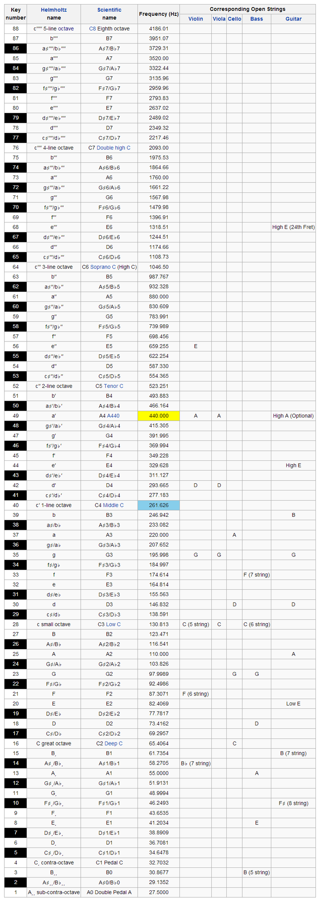

# Chordination

### [Play on Github](https://mrjones91.github.io/NextJam/src/build/raylib_game.html)

### [Play on Itch.io](https://dij.itch.io/chordination)

### Description

Play some music, all you have to do is connect the notes. 
Thinking about the connection of notes that allows for the creation of music, I built a player that would allow you to play a tune by connecting the notes you play together into a song.
Choose to play notes sequentially, by skipping a note, playing notes in the same chord or going up an octave. The various connections make your tune earn a higher score depending on the difficulty/length of the connection to the next note.

### Features

 - C Major Scale
 - Color-coded notes to visually see the connections you're making
 - Creative Music Sim on Your Device
 - Coming SOON
    - Save and Playback Songs
    - Scoring and High Scores

### Controls

Keyboard/Touchscreen
 - Left/Right - Change the Connection Length to Your Next Note
 - Up/Down - Move to a New Note
 - Space | Tap - Pause/Resume Audio

### Screenshots

### Developers

 - DJ - Game Designer and Programmer
 - Kingston - Producer

### Links

 - itch.io Release: https://dij.itch.io/chordination

### Thanks

- [Wikipedia: Piano Key Frequencies](https://en.wikipedia.org/wiki/Piano_key_frequencies)

- 

- [Note Frequencies](https://web.archive.org/web/20191216163453/https://pages.mtu.edu/~suits/notefreqs.html)

### License

This project sources are licensed under an unmodified zlib/libpng license, which is an OSI-certified, BSD-like license that allows static linking with closed source software. Check [LICENSE](LICENSE) for further details.

*Copyright (c) 2024 mrjones91*
